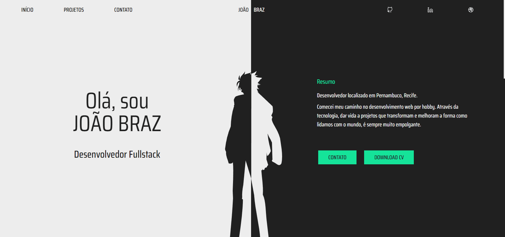
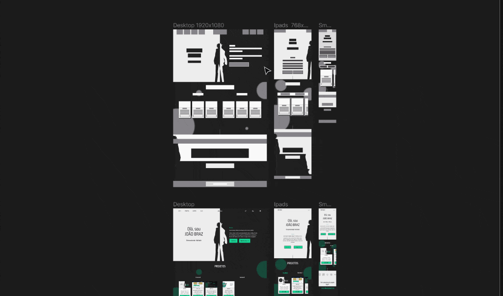

# Portfólio

This is my porfólio where you can view some of the projects that I've been made. Feel free to get in touch!

## Contents

- [Overview](#overview)
- [Prototype](#prototype)
- [React](#react)
- [Tailwind](#tailwind)
- [References](#references)

## Overview

This project was the first one that I've built from scratch with React applying what I've been studying last months. Furthermore, also was the first where I created an entire prototype using Figma.
For style I used the Tailwind, one of the most famous  css framework nowadays.

## Prototype

I don't be a designer, but I like design and experiment some tools because they helps to create interfaces visually attractive. One of the most famous tool to prototype web interfaces is Figma and I totally enjoyed to try it.

## React